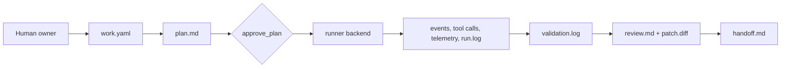
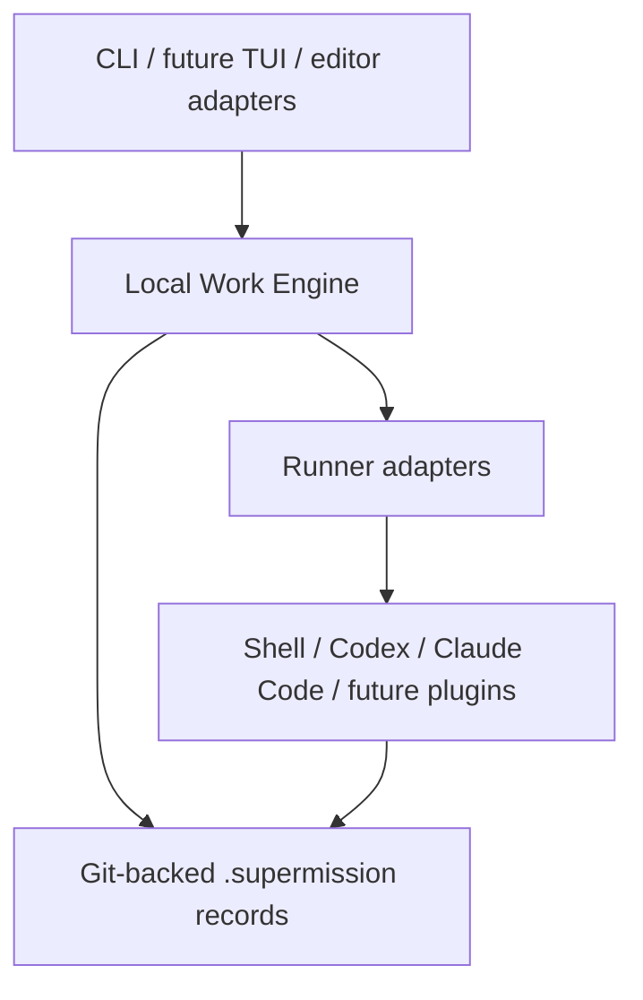

# Supermission

[](#v0-scope)
[](#installation--release-status)
[](#toolchain)
[](#toolchain)
[](#verification)
[](./LICENSE)

[中文 README](./README.zh-CN.md)

Supermission is an early implementation of local-first work records for AI-assisted software delivery.

The product direction is ambitious: work records, agent orchestration,
observability, validation, review, handoff, and rollback for AI-assisted
software work. The implementation starts conservatively: Bun-first TypeScript,
repo-native records, linear code mutations, and strong tests.

## Toolchain

- Bun
- TypeScript
- commander
- zod
- yaml
- minimatch
- Vitest
- fast-check
- Playwright
- StrykerJS
- tsup
- ESLint
- Prettier

## V0 Scope

- Git-backed `.supermission/<work-id>/` records.
- `work.yaml` as the work spec and status file.
- `requirements-analysis.md` for pre-implementation requirement quality checks.
- Append-only `events.jsonl`, `telemetry.jsonl`, `tool-calls.jsonl`, and
  `supervisor-signals.jsonl`.
- `tasks/` task ledger with orchestration-ready roles and mutation modes.
- `plan.md`, `run.log`, `validation.log`, `debug.md`, `handoff.md`, `decisions.md`,
  `review.md`, `monitor.md`, and `patch.diff` artifacts.
- A headless CLI that can create, plan, approve, run, validate, trace, inspect,
  monitor, debug, and hand off a work record.
- Controlled change proposals through `supermission change ...`.
- Task dependencies and a linear mutation guard: sidecar tasks can run in
  parallel, but only one `linear_write` task may be running at a time.
- Runner backends can execute shell, Codex, and Claude Code through a shared
  supermission run interface.

The core engine stays runner-neutral. Model runtimes live behind runner/adapter
layers and are optional per work record.

## Multi-Agent Pipeline System

Supermission supports YAML-defined multi-agent pipelines where each stage can
use a different AI agent CLI. Built-in templates:

- `feature` — plan → code → test → review
- `bugfix` — reproduce → fix → verify
- `deploy` — plan → code → test → review → deploy

```bash
supermission pipeline init                              # Create templates
supermission pipeline run feature "Add OAuth2 login"    # Run end-to-end
supermission pipeline run bugfix "Fix null pointer"     # Quick bugfix
supermission pipeline batch feature "Feature A" "Feature B"  # Multiple features
```

Custom pipelines are simple YAML files in `.supermission/pipelines/`:

```yaml
name: my-pipeline
stages:
  - id: plan
    role: planner-agent
    backend: gemini
    prompt: "Break down this feature"
    gate: approve_plan
  - id: code
    role: worker-agent
    backend: claude
    prompt: "Implement the feature"
  - id: test
    role: tester-agent
    backend: codex
    validation: "bun run test"
```

## Supported Agent Backends

Supermission supports 13 runner backends with smart selection and fallback:

| Backend    | CLI        | Description                  |
| ---------- | ---------- | ---------------------------- |
| `shell`    | any        | Execute local shell commands |
| `codex`    | `codex`    | OpenAI Codex                 |
| `claude`   | `claude`   | Anthropic Claude Code        |
| `kiro`     | `kiro`     | AWS Kiro CLI                 |
| `kimi`     | `kimi`     | Moonshot Kimi CLI            |
| `gemini`   | `gemini`   | Google Gemini CLI            |
| `aider`    | `aider`    | Aider AI pair programming    |
| `opencode` | `opencode` | OpenCode terminal agent      |
| `copilot`  | `gh`       | GitHub Copilot CLI           |
| `amazon-q` | `q`        | Amazon Q Developer           |
| `goose`    | `goose`    | Block Goose agent            |
| `grok`     | `grok`     | xAI Grok CLI                 |
| `record`   | —          | Record external/manual runs  |

Smart selection auto-detects installed CLIs and routes by role:

```yaml
# .supermission/runners.yaml
default_backend: auto
fallback_order: [codex, claude, kiro, kimi, gemini]
routing:
  planner-agent: gemini
  worker-agent: claude
  tester-agent: codex
  reviewer-agent: gemini
```

## Team Collaboration

Git-native collaboration without requiring a server:

```bash
supermission team init
supermission team add --name "Alice" --role lead
supermission team add --name "Bob" --role developer
supermission team add --name "Codex Worker" --kind agent --role agent --backend codex

supermission new "Fix login bug" --assign bob
supermission board                    # Kanban view with assignees
supermission board --mine             # My assigned work only
supermission assign work-001 --to alice
```

Team state syncs through git push/pull. No server needed for small teams.

## Cost Tracking

```bash
supermission cost work-001            # Token usage, runtime, cost estimate per backend
```

## Web Dashboard

```bash
supermission serve                    # Start local dashboard at http://localhost:4000
supermission serve --port 8080 --open # Custom port, auto-open browser
```

## Product Shape

Supermission should not replace Codex, Claude Code, or IDE coding agents. The
target shape is:

- a standalone local engine that owns work records, evidence, validation, review,
  handoff, and recovery state
- a fast CLI first, then a TUI over the same engine
- optional adapters/plugins so Codex, Claude Code, IDEs, and future app surfaces
  can start work, read status, attach evidence, or run validations
- a background process later for streaming runner progress, cancellation,
  notifications, and cached projections

The engine is the source of truth; Codex/Claude/IDE tools are workers or
clients. This keeps Supermission useful for people who prefer existing coding
agents while still giving every run durable project evidence.

UX and responsiveness are product requirements, not polish. Long runner work
must expose phase, elapsed time, retry/profile attempt, latest output, cancel
path, and recovery path. Local list/status/summary commands should stay fast
enough to use repeatedly during a coding session.

## Installation & Release Status

Supermission is not published to npm yet but can be installed via script.

Quick install (macOS/Linux):

```bash
curl -fsSL https://raw.githubusercontent.com/hongbinzuo/supermission/main/scripts/install.sh | bash
```

Windows (PowerShell):

```powershell
irm https://raw.githubusercontent.com/hongbinzuo/supermission/main/scripts/install.ps1 | iex
```

The install script auto-detects your system, installs Bun if needed, clones the
repo, builds, and creates a symlink. It also detects which agent CLIs you have
installed.

Local development:

```bash
bun install
bun run build
bin/supermission --help
```

First-time project setup:

```bash
cd your-project
supermission init                    # Auto-detect agent CLIs, set defaults
supermission pipeline init           # Create pipeline templates
supermission quick "Your first task" # Run end-to-end
```

When `superm` runs inside tmux, creating a new work item automatically opens a
standard terminal layout: the current pane stays as the control pane, with
right, bottom, and bottom-right panes for status, monitor, and trace views. Set
`SUPERMISSION_TERMINAL_LAYOUT=0` to disable the auto layout.

## Execution Model

V0 is orchestration-ready but intentionally linear for code mutations.

- Sidecar tasks can be parallel later: research, test planning, docs, review,
  log analysis, and validation analysis.
- Code/config/schema/environment mutations remain linear until merge queue,
  rollback checkpoints, review gates, and conflict handling are mature.





## Quick Start

```bash
bun install
bun run build

bin/supermission new "Add login validation" \
  --acceptance "Invalid logins show an error" \
  --validation "bun run test"

bin/supermission plan <work-id>
bin/supermission requirements check <work-id>
bin/supermission approve <work-id>
bin/supermission run <work-id> \
  --backend shell \
  --command "printf 'implemented' > runner-output.txt"
bin/supermission run <work-id> \
  --backend codex \
  --profile your-profile \
  --fallback-profile another-profile \
  --prompt "Reply only with codex-smoke-ok." \
  --timeout-ms 60000
bin/supermission run <work-id> \
  --backend claude \
  --prompt "Reply only with claude-smoke-ok." \
  --timeout-ms 60000
bin/supermission validate <work-id>
bin/supermission change propose <work-id> \
  --reason "Acceptance criteria need one more security case" \
  --type security \
  --risk medium \
  --affected acceptance \
  --option update_acceptance \
  --recommendation update_acceptance
bin/supermission change approve <work-id> change-001 --reason "Security case is in scope"
bin/supermission change apply <work-id> change-001 \
  --acceptance "Security-sensitive inputs are covered by validation evidence" \
  --validation "bun run test" \
  --workflow-step review \
  --plan-note "Review security evidence before handoff"
bin/supermission diff <work-id>
bin/supermission diff <work-id> --task task-001
bin/supermission checkpoint create <work-id> --label "before review"
bin/supermission checkpoint create <work-id> --label "task patch" --task task-001
bin/supermission checkpoint list <work-id>
bin/supermission branch create <work-id>
bin/supermission worktree create <work-id> --path ../work-worktree
bin/supermission rollback-plan <work-id>
bin/supermission rollback-check <work-id>
bin/supermission policy init --validation-allow "bun run *" --redaction-pattern "session-id=[A-Za-z0-9]+"
bin/supermission policy show
bin/supermission doctor <work-id>
bin/supermission summary <work-id>
bin/supermission review create <work-id>
bin/supermission task add <work-id> \
  --title "Write a test plan" \
  --actor-role tester-agent \
  --mutation-mode sidecar_artifact \
  --scope-allow ".supermission/**"
bin/supermission task rename <work-id> task-002 --title "Review test plan"
bin/supermission task set-status <work-id> task-002 --status done
bin/supermission task audit-scope <work-id> task-001
bin/supermission runner list
bin/supermission runner profiles --backend codex
bin/supermission runner config init \
  --default-backend codex \
  --profile your-profile \
  --fallback-profile another-profile \
  --timeout-ms 60000
bin/supermission runner config show
bin/supermission runner smoke --backend codex --profile current --timeout-ms 60000
bin/supermission handoff <work-id>
bin/supermission trace <work-id>
bin/supermission inspect <work-id> events 0
bin/supermission inspect <work-id> events event-000001
```

## Human Test Flow

When a V0 review build is ready, use this flow:

```bash
# 1. Create a work with evidence requirements.
bin/supermission new "Human review smoke mission" \
  --id work-smoke \
  --acceptance "The CLI records work state and validation evidence" \
  --validation "bun run test"

# 2. Move through the linear workflow.
bin/supermission plan work-smoke
bin/supermission approve work-smoke --reason "Plan is acceptable"
bin/supermission run work-smoke --note "Manual implementation placeholder"
bin/supermission validate work-smoke

# 3. Check observability.
bin/supermission status work-smoke
bin/supermission monitor work-smoke
bin/supermission doctor work-smoke
bin/supermission trace work-smoke
bin/supermission logs work-smoke
bin/supermission tasks work-smoke

# 4. Exercise controlled change.
bin/supermission change propose work-smoke \
  --reason "Add one more acceptance check before handoff" \
  --type workflow \
  --risk low \
  --affected acceptance \
  --option update_acceptance \
  --recommendation update_acceptance
bin/supermission change show work-smoke change-001
bin/supermission change approve work-smoke change-001 --reason "Still in scope"

# 5. Capture review/rollback evidence.
bin/supermission diff work-smoke
bin/supermission checkpoint create work-smoke --label "before handoff"
bin/supermission rollback-plan work-smoke

# 6. Complete handoff.
bin/supermission handoff work-smoke
bin/supermission doctor work-smoke
```

Inspect generated artifacts:

```bash
find .supermission/work-smoke -maxdepth 2 -type f | sort
```

## Command Index

Core flow:

- `supermission new`
- `supermission plan`
- `supermission requirements check`
- `supermission approve`
- `supermission run`
- `supermission validate`
- `supermission handoff`

Human review and observability:

- `supermission status`
- `work summary`
- `supermission monitor`
- `supermission doctor`
- `supermission trace`
- `supermission logs`
- `supermission debug`
- `supermission inspect` by zero-based index or stable record id
- `supermission review create`
- `supermission policy init`
- `supermission policy show`

Controlled change:

- `supermission change propose`
- `supermission change list`
- `supermission change show`
- `supermission change approve`
- `supermission change apply`
- `supermission change reject`
- `supermission change defer`
- `supermission change split`

Task ledger:

- `supermission tasks`
- `supermission task add`
- `supermission task rename`
- `supermission task set-status`
- `supermission task audit-scope`

Runner diagnostics:

- `supermission runner list`
- `supermission runner profiles`
- `supermission runner config init`
- `supermission runner config show`
- `supermission runner smoke`

Multi-agent pipelines:

- `supermission pipeline init`
- `supermission pipeline list`
- `supermission pipeline show`
- `supermission pipeline run`
- `supermission pipeline batch`

Team collaboration:

- `supermission team init`
- `supermission team add`
- `supermission team remove`
- `supermission team list`
- `supermission assign`
- `supermission release`

Project setup and observability:

- `supermission init`
- `supermission quick`
- `supermission board`
- `supermission cost`
- `supermission serve`

Git evidence and isolation:

- `supermission diff`
- `supermission checkpoint create`
- `supermission checkpoint list`
- `supermission branch create`
- `supermission worktree create`
- `supermission rollback-plan`
- `supermission rollback-check`

During development, use:

```bash
bun run supermission -- status
```

## Product Roadmap

The roadmap is milestone-based and should change with the implementation. See
[`AGENTS.md`](./AGENTS.md) for the rule that future agents must keep this section
and release docs current.

| Milestone | Focus                                                                                                                                                       | Current status |
| --------- | ----------------------------------------------------------------------------------------------------------------------------------------------------------- | -------------- |
| V0        | Local-first work records, CLI state machine, artifacts, validation, review, handoff, rollback planning                                                      | Done           |
| V0.5      | Unified runner layer: 13 backends (shell, codex, claude, kiro, kimi, gemini, aider, opencode, copilot, amazon-q, goose, grok); smart selection and fallback | Done           |
| V0.6      | Multi-agent pipelines, team collaboration, assignment, board view, cost tracking, web dashboard, install scripts                                            | Done           |
| V0.7      | Project management (milestones, cycles, priorities), Linear/Jira/GitHub integration, import/export                                                          | In progress    |
| V0.8      | Notifications (inbox, webhooks), lock manager, conflict detection, coordination index                                                                       | Planned        |
| V1        | Terminal TUI (React Ink), polished web dashboard, streaming runner progress                                                                                 | Planned        |
| V1.5      | Editor adapters (VS Code, Kiro), persistent agent memory                                                                                                    | Planned        |
| V2        | Open-source extension points, npm publish, Homebrew, documented compatibility targets                                                                       | Planned        |

Primary baseline: Factory Missions-style collaborative planning, milestone
execution, and validation. Supermission is the open-source, local-first version
of that direction, with repo-native records as the source of truth.

Reference projects are tracked in
[`docs/research/agent-orchestration-reference.md`](./docs/research/agent-orchestration-reference.md).
They are used for concepts and abstractions, not as a feature checklist.
Kiro, Codex, Claude Code, and agent orchestration gaps are tracked in
[`docs/research/kiro-codex-claude-orchestration-gap-analysis.md`](./docs/research/kiro-codex-claude-orchestration-gap-analysis.md).
Token/runtime performance strategy is tracked in
[`docs/research/token-performance-strategy.md`](./docs/research/token-performance-strategy.md).
Agent scheduling, communication, and UI performance tradeoffs are tracked in
[`docs/research/agent-scheduling-communication-ui-performance.md`](./docs/research/agent-scheduling-communication-ui-performance.md).
Supermission's own product capability evaluation loop is tracked in
[`docs/evaluations/supermission-capability-evaluation.md`](./docs/evaluations/supermission-capability-evaluation.md).
The current local deterministic baseline fixture is
[`evals/supermission-capability-baseline.yaml`](./evals/supermission-capability-baseline.yaml).
MVP release gates are tracked in
[`docs/releases/mvp-release-checklist.md`](./docs/releases/mvp-release-checklist.md).
For web-project validation, Playwright is the default deterministic path.
Computer/browser-use agents are future optional exploratory validators, not a
replacement for repeatable assertions and trace evidence.

## Verification

```bash
bun run check
bun run lint
bun run format:check
BUN_BIN="$HOME/.bun/bin/bun" bun run test:capability
BUN_BIN="$HOME/.bun/bin/bun" bun run test
bun run build
```

Real external runner smoke tests are opt-in so a missing local profile does not
make normal unit tests flaky. To block on a real backend, enable it explicitly:

```bash
SUPERMISSION_RUNNER_SMOKE=codex SUPERMISSION_CODEX_PROFILE=your-profile bun run test
SUPERMISSION_RUNNER_SMOKE=claude bun run test
SUPERMISSION_RUNNER_SMOKE=all SUPERMISSION_CODEX_PROFILE=your-profile bun run test
```

`--profile <name>` on the Codex backend first tries to resolve a matching CC
Switch codex provider by name or id. If found, Supermission creates a temporary
`CODEX_HOME` for that child process and does not write provider secrets to the
repo or run log. If no CC Switch provider matches, the value is passed through to
Codex as a native `-p/--profile`.

Use `--profile current` to follow the current CC Switch Codex provider.

Use `--fallback-profile` repeatedly when a runner should keep trying alternate
profiles before failing the supermission run.

Project defaults live in `.supermission/runners.yaml`. Use
`supermission runner config init/show` to manage a first version of that file. Explicit
`supermission run` flags override the project config.

The current tests include black-box CLI integration, property-based tests,
schema validation, failure branches, supervisor signals, and a basic trace
performance budget. `bun run test:capability` runs the current Supermission
product capability baseline without external model calls. Run `bun run test` for
the current full count.

## Decisions And Remaining Work

- Core workflow gates are enforced: `approve_plan` requires `planned`, `run`
  requires an approved/review/recovery state, and completing handoff requires
  `validated`.
- License: Apache-2.0.
- Public release path: npm first, then GitHub Releases; Homebrew/Docker later.
- Real external runner smoke tests stay explicit and opt-in. Missing or invalid
  credentials must fail clearly, and secrets must never be printed or committed.
- `.supermission/` remains the source of truth. A future database may only be a
  rebuildable index/cache.
- Whether validation without commands should be `blocked` or `needs_decision`.
- `supermission inspect` supports zero-based indexes and stable append-only record ids
  such as `event-000001`; new JSONL records persist those ids on write.
- Optional `.supermission/policy.yaml` `validation_allowlist` entries restrict which
  validation commands can run; risky commands also require both `--allow-risky`
  and a prior `approve_risky_command` gate.
- Optional `.supermission/policy.yaml` `redaction.patterns` entries add custom
  regex-based secret redaction on top of the built-in token/key heuristics.
- `supermission policy init/show` manages the project policy file.
- Secret redaction covers common env vars, JSON fields, API-key headers, Bearer
  tokens, OpenAI-style `sk-*`, GitHub, and GitLab token shapes, and can be
  extended per repo through policy.
- Runner adapter normalization now covers shell, Claude Code, and Codex.
- `supermission change apply` safely appends approved acceptance criteria, validation
  commands, workflow steps, and controlled plan notes to work artifacts;
  richer structured `plan.md` patching remains TBD.
- `supermission diff --task` and `supermission checkpoint create --task` capture patches
  inside a task's scope and still emit `scope_drift` evidence for out-of-scope
  current changes.
- Patch snapshots include tracked changes and untracked files, while excluding
  `.supermission/**` evidence by default.
- Checkpoints are currently non-destructive capture artifacts. Automatic rollback is TBD.
- `branch`, `worktree`, and `rollback-plan` are explicit and non-magical. Worktree
  creation requires a path; rollback only writes a plan.
- `rollback-check` verifies whether a checkpoint patch can be reversed cleanly
  without applying it.
- `doctor` reports work health and exits non-zero when blocking issues exist.
- `monitor` writes `monitor.md` and prints the current work health, active
  tasks, pending changes, supervisor signals, recent events, and next actions.
- Repeated validation failures are emitted as `repeated_failure` supervisor
  signals; stale running tasks are diagnosed as `stuck` warnings.
- `summary` prints a compact human review surface with status, findings, counts,
  and artifact paths.
- `review create` generates a human-reviewable `review.md` from current evidence.
- `task add/rename/set-status` lets sidecar work be recorded and renamed without
  opening parallel code mutations.
- `task set-status --status running` prevents concurrent `linear_write` tasks.
  Completed dependencies automatically unblock pending dependent tasks.
- `task audit-scope` checks current git changes against a task's allow/deny
  scope and records `scope_drift` supervisor signals when needed.
- Risky validation commands are blocked by default; use
  `supermission approve --gate approve_risky_command` before rerunning with
  `--allow-risky`.
- Validation logs and tool-call records redact common token/key/secret patterns
  before writing artifacts.
