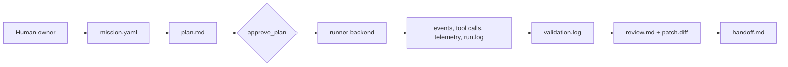
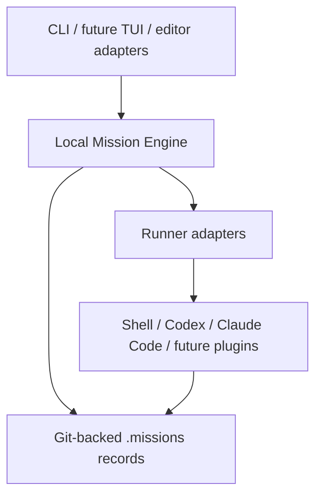

# Supermission

[](#v0-scope)
[](#installation--release-status)
[](#toolchain)
[](#toolchain)
[](#verification)
[](#tbd--needs-review)

[中文 README](./README.zh-CN.md)

Supermission is an early implementation of Mission Control for AI Coding.

The product direction is ambitious: mission records, agent orchestration,
observability, validation, review, handoff, and rollback for AI-assisted
software work. The implementation starts conservatively: Bun-first TypeScript,
repo-native records, linear code mutations, and strong tests.

## Toolchain

- Bun
- TypeScript
- commander
- zod
- yaml
- minimatch
- Vitest
- fast-check
- Playwright
- StrykerJS
- tsup
- ESLint
- Prettier

## V0 Scope

- Git-backed `.missions/<mission-id>/` records.
- `mission.yaml` as the mission spec and status file.
- Append-only `events.jsonl`, `telemetry.jsonl`, `tool-calls.jsonl`, and
  `supervisor-signals.jsonl`.
- `tasks/` task ledger with orchestration-ready roles and mutation modes.
- `plan.md`, `run.log`, `validation.log`, `debug.md`, `handoff.md`, `decisions.md`,
  `review.md`, `monitor.md`, and `patch.diff` artifacts.
- A headless CLI that can create, plan, approve, run, validate, trace, inspect,
  monitor, debug, and hand off a mission.
- Controlled change proposals through `mission change ...`.
- Task dependencies and a linear mutation guard: sidecar tasks can run in
  parallel, but only one `linear_write` task may be running at a time.
- Runner backends can execute shell, Codex, and Claude Code through a shared
  mission run interface.

The core engine stays runner-neutral. Model runtimes live behind runner/adapter
layers and are optional per mission.

## Installation & Release Status

Supermission is not published yet.

- `package.json` is currently marked `"private": true`.
- There is no npm, Homebrew, Docker, or binary release channel yet.
- Current install path is local development from this repository.
- Release documentation must be updated before the first public package.

Local development:

```bash
bun install
bun run build
bin/mission --help
```

## Execution Model

V0 is orchestration-ready but intentionally linear for code mutations.

- Sidecar tasks can be parallel later: research, test planning, docs, review,
  log analysis, and validation analysis.
- Code/config/schema/environment mutations remain linear until merge queue,
  rollback checkpoints, review gates, and conflict handling are mature.





## Quick Start

```bash
bun install
bun run build

bin/mission new "Add login validation" \
  --acceptance "Invalid logins show an error" \
  --validation "bun run test"

bin/mission plan <mission-id>
bin/mission approve <mission-id>
bin/mission run <mission-id> \
  --backend shell \
  --command "printf 'implemented' > runner-output.txt"
bin/mission run <mission-id> \
  --backend codex \
  --profile your-profile \
  --prompt "Reply only with codex-smoke-ok." \
  --timeout-ms 60000
bin/mission run <mission-id> \
  --backend claude \
  --prompt "Reply only with claude-smoke-ok." \
  --timeout-ms 60000
bin/mission validate <mission-id>
bin/mission change propose <mission-id> \
  --reason "Acceptance criteria need one more security case" \
  --type security \
  --risk medium \
  --affected acceptance \
  --option update_acceptance \
  --recommendation update_acceptance
bin/mission change approve <mission-id> change-001 --reason "Security case is in scope"
bin/mission change apply <mission-id> change-001 \
  --acceptance "Security-sensitive inputs are covered by validation evidence" \
  --validation "bun run test" \
  --workflow-step review \
  --plan-note "Review security evidence before handoff"
bin/mission diff <mission-id>
bin/mission diff <mission-id> --task task-001
bin/mission checkpoint create <mission-id> --label "before review"
bin/mission checkpoint create <mission-id> --label "task patch" --task task-001
bin/mission checkpoint list <mission-id>
bin/mission branch create <mission-id>
bin/mission worktree create <mission-id> --path ../mission-worktree
bin/mission rollback-plan <mission-id>
bin/mission rollback-check <mission-id>
bin/mission policy init --validation-allow "bun run *" --redaction-pattern "session-id=[A-Za-z0-9]+"
bin/mission policy show
bin/mission doctor <mission-id>
bin/mission summary <mission-id>
bin/mission review create <mission-id>
bin/mission task add <mission-id> \
  --title "Write a test plan" \
  --actor-role tester-agent \
  --mutation-mode sidecar_artifact \
  --scope-allow ".missions/**"
bin/mission task set-status <mission-id> task-002 --status done
bin/mission task audit-scope <mission-id> task-001
bin/mission runner list
bin/mission runner profiles --backend codex
bin/mission handoff <mission-id>
bin/mission trace <mission-id>
bin/mission inspect <mission-id> events 0
bin/mission inspect <mission-id> events event-000001
```

## Human Test Flow

When a V0 review build is ready, use this flow:

```bash
# 1. Create a mission with evidence requirements.
bin/mission new "Human review smoke mission" \
  --id human-smoke \
  --acceptance "The CLI records mission state and validation evidence" \
  --validation "bun run test"

# 2. Move through the linear workflow.
bin/mission plan human-smoke
bin/mission approve human-smoke --reason "Plan is acceptable"
bin/mission run human-smoke --note "Manual implementation placeholder"
bin/mission validate human-smoke

# 3. Check observability.
bin/mission status human-smoke
bin/mission monitor human-smoke
bin/mission doctor human-smoke
bin/mission trace human-smoke
bin/mission logs human-smoke
bin/mission tasks human-smoke

# 4. Exercise controlled change.
bin/mission change propose human-smoke \
  --reason "Add one more acceptance check before handoff" \
  --type workflow \
  --risk low \
  --affected acceptance \
  --option update_acceptance \
  --recommendation update_acceptance
bin/mission change show human-smoke change-001
bin/mission change approve human-smoke change-001 --reason "Still in scope"

# 5. Capture review/rollback evidence.
bin/mission diff human-smoke
bin/mission checkpoint create human-smoke --label "before handoff"
bin/mission rollback-plan human-smoke

# 6. Complete handoff.
bin/mission handoff human-smoke
bin/mission doctor human-smoke
```

Inspect generated artifacts:

```bash
find .missions/human-smoke -maxdepth 2 -type f | sort
```

## Command Index

Core flow:

- `mission new`
- `mission plan`
- `mission approve`
- `mission run`
- `mission validate`
- `mission handoff`

Human review and observability:

- `mission status`
- `mission summary`
- `mission monitor`
- `mission doctor`
- `mission trace`
- `mission logs`
- `mission debug`
- `mission inspect` by zero-based index or stable record id
- `mission review create`
- `mission policy init`
- `mission policy show`

Controlled change:

- `mission change propose`
- `mission change list`
- `mission change show`
- `mission change approve`
- `mission change apply`
- `mission change reject`
- `mission change defer`
- `mission change split`

Task ledger:

- `mission tasks`
- `mission task add`
- `mission task set-status`
- `mission task audit-scope`

Runner diagnostics:

- `mission runner list`
- `mission runner profiles`

Git evidence and isolation:

- `mission diff`
- `mission checkpoint create`
- `mission checkpoint list`
- `mission branch create`
- `mission worktree create`
- `mission rollback-plan`
- `mission rollback-check`

During development, use:

```bash
bun run mission -- status
```

## Product Roadmap

The roadmap is milestone-based and should change with the implementation. See
[`AGENTS.md`](./AGENTS.md) for the rule that future agents must keep this section
and release docs current.

| Milestone | Focus                                                                                                                                   | Current status |
| --------- | --------------------------------------------------------------------------------------------------------------------------------------- | -------------- |
| V0        | Local-first mission records, CLI state machine, artifacts, validation, review, handoff, rollback planning                               | In progress    |
| V0.5      | Unified runner layer across record, shell, Codex, and Claude Code; real integration smoke tests with explicit credentials/profile setup | In progress    |
| V0.6      | Plugin/component boundaries for runners, validators, artifact writers, policies, and workflow templates                                 | Planned        |
| V0.7      | Stronger Git/worktree isolation, task queues, merge checkpoints, and recovery signals                                                   | Planned        |
| V1        | Terminal TUI over the same engine, no duplicated mission logic                                                                          | Planned        |
| V1.5      | Editor adapters after CLI/TUI contracts stabilize                                                                                       | Planned        |
| V2        | Open-source extension points, package/release pipeline, and documented compatibility targets                                            | Planned        |

Primary baseline: Factory Missions-style collaborative planning, milestone
execution, and validation. Supermission is the open-source, local-first version
of that direction, with repo-native records as the source of truth.

Reference projects are tracked in
[`docs/research/agent-orchestration-reference.md`](./docs/research/agent-orchestration-reference.md).
They are used for concepts and abstractions, not as a feature checklist.

## Verification

```bash
bun run check
bun run lint
bun run format:check
BUN_BIN="$HOME/.bun/bin/bun" bun run test
bun run build
```

Real external runner smoke tests are opt-in so a missing local profile does not
make normal unit tests flaky. To block on a real backend, enable it explicitly:

```bash
SUPERMISSION_RUNNER_SMOKE=codex SUPERMISSION_CODEX_PROFILE=your-profile bun run test
SUPERMISSION_RUNNER_SMOKE=claude bun run test
SUPERMISSION_RUNNER_SMOKE=all SUPERMISSION_CODEX_PROFILE=your-profile bun run test
```

`--profile <name>` on the Codex backend first tries to resolve a matching CC
Switch codex provider by name or id. If found, Supermission creates a temporary
`CODEX_HOME` for that child process and does not write provider secrets to the
repo or run log. If no CC Switch provider matches, the value is passed through to
Codex as a native `-p/--profile`.

The current tests include black-box CLI integration, property-based tests,
schema validation, failure branches, supervisor signals, and a basic trace
performance budget. Run `bun run test` for the current count.

## TBD / Needs Review

- Core workflow gates are enforced: `approve_plan` requires `planned`, `run`
  requires an approved/review/recovery state, and completing handoff requires
  `validated`.
- Whether validation without commands should be `blocked` or `needs_decision`.
- `mission inspect` supports zero-based indexes and stable append-only record ids
  such as `event-000001`; new JSONL records persist those ids on write.
- Optional `.missions/policy.yaml` `validation_allowlist` entries restrict which
  validation commands can run; risky commands also require both `--allow-risky`
  and a prior `approve_risky_command` gate.
- Optional `.missions/policy.yaml` `redaction.patterns` entries add custom
  regex-based secret redaction on top of the built-in token/key heuristics.
- `mission policy init/show` manages the project policy file.
- Secret redaction covers common env vars, JSON fields, API-key headers, Bearer
  tokens, OpenAI-style `sk-*`, GitHub, and GitLab token shapes, and can be
  extended per repo through policy.
- Runner adapter normalization now covers shell, Claude Code, and Codex.
- `mission change apply` safely appends approved acceptance criteria, validation
  commands, workflow steps, and controlled plan notes to mission artifacts;
  richer structured `plan.md` patching remains TBD.
- `mission diff --task` and `mission checkpoint create --task` capture patches
  inside a task's scope and still emit `scope_drift` evidence for out-of-scope
  current changes.
- Patch snapshots include tracked changes and untracked files, while excluding
  `.missions/**` evidence by default.
- Checkpoints are currently non-destructive capture artifacts. Automatic rollback is TBD.
- `branch`, `worktree`, and `rollback-plan` are explicit and non-magical. Worktree
  creation requires a path; rollback only writes a plan.
- `rollback-check` verifies whether a checkpoint patch can be reversed cleanly
  without applying it.
- `doctor` reports mission health and exits non-zero when blocking issues exist.
- `monitor` writes `monitor.md` and prints the current mission health, active
  tasks, pending changes, supervisor signals, recent events, and next actions.
- Repeated validation failures are emitted as `repeated_failure` supervisor
  signals; stale running tasks are diagnosed as `stuck` warnings.
- `summary` prints a compact human review surface with status, findings, counts,
  and artifact paths.
- `review create` generates a human-reviewable `review.md` from current evidence.
- `task add/set-status` lets sidecar work be recorded without opening parallel
  code mutations.
- `task set-status --status running` prevents concurrent `linear_write` tasks.
  Completed dependencies automatically unblock pending dependent tasks.
- `task audit-scope` checks current git changes against a task's allow/deny
  scope and records `scope_drift` supervisor signals when needed.
- Risky validation commands are blocked by default; use
  `mission approve --gate approve_risky_command` before rerunning with
  `--allow-risky`.
- Validation logs and tool-call records redact common token/key/secret patterns
  before writing artifacts.
