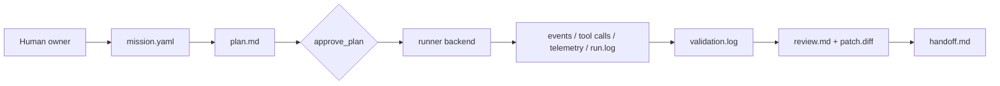
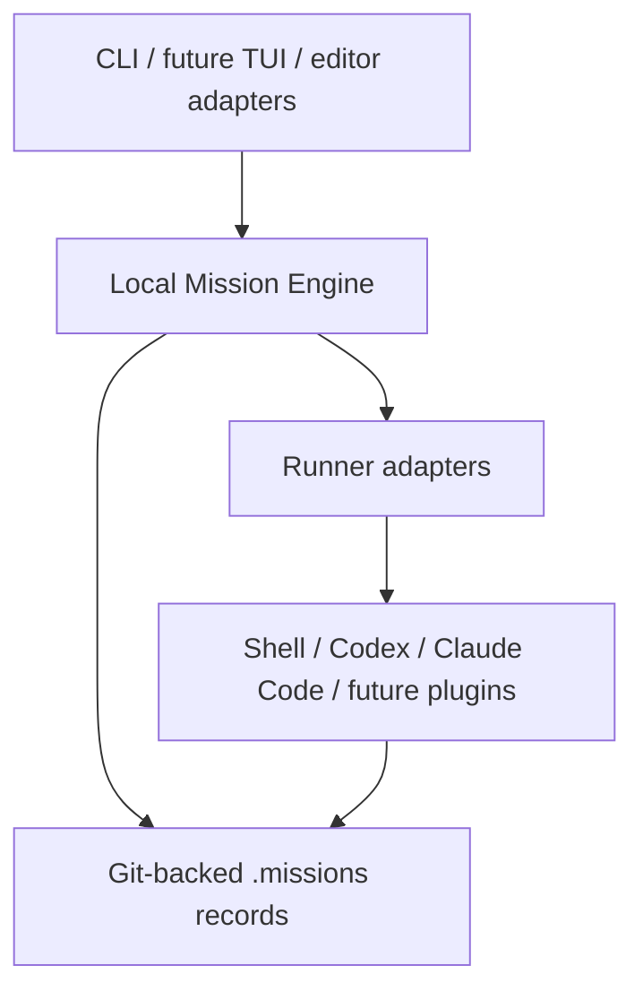

# Supermission

[](#v0-范围)
[](#安装与发布状态)
[](#工具链)
[](#工具链)
[](#验证)
[](#待确认)

[English README](./README.md)

Supermission 是一个早期的开源 Mission Control for AI Coding 实现。

产品方向是把 AI coding 从聊天记录变成工程记录：任务规格、计划、执行、
验证、评审、交接、回退和可观测证据都沉淀到仓库里。当前实现保持克制：
Bun-first TypeScript、本地优先、Git-backed `.missions/` 记录、线性代码变更、
强测试和可扩展 runner 层。

## V0 范围

- Git-backed `.missions/<mission-id>/` 任务记录。
- `mission.yaml` 作为 mission 规格和状态文件。
- Append-only `events.jsonl`、`telemetry.jsonl`、`tool-calls.jsonl`、
  `supervisor-signals.jsonl`。
- `tasks/` 任务台账，保留 actor role、依赖和 mutation mode。
- `plan.md`、`run.log`、`validation.log`、`debug.md`、`handoff.md`、
  `decisions.md`、`review.md`、`monitor.md`、`patch.diff` 等工程产物。
- Headless CLI：创建、规划、批准、执行、验证、追踪、检查、监控、调试和交接。
- 受控变更流程：`mission change ...`。
- 线性代码变更保护：sidecar 任务后续可并行，但 `linear_write` 同时只能有一个。
- 统一 runner 层：`record`、`shell`、`codex`、`claude` 通过同一 mission run 接口接入。

核心 engine 保持 runner-neutral。模型运行时放在 runner/adapter 层，按 mission 可选启用。

## 安装与发布状态

当前还没有正式安装包或发布渠道。

- `package.json` 目前是 `"private": true`。
- 还没有 npm、Homebrew、Docker 或二进制发布。
- 当前使用方式是从仓库本地开发运行。
- 第一次公开发布前，必须补齐 release 文档和安装说明。

本地开发：

```bash
bun install
bun run build
bin/mission --help
```

## 工具链

- Bun
- TypeScript
- commander
- zod
- yaml
- minimatch
- Vitest
- fast-check
- Playwright
- StrykerJS
- tsup
- ESLint
- Prettier

## 执行模型

V0 已为编排做准备，但代码变更仍然保持线性。

- 以后可以并行的 sidecar 任务：调研、测试计划、文档、评审、日志分析、验证分析。
- 代码、配置、schema、环境变更继续线性执行，直到 merge queue、回退检查点、
  review gate 和冲突处理成熟。





## 快速开始

```bash
bun install
bun run build

bin/mission new "Add login validation" \
  --acceptance "Invalid logins show an error" \
  --validation "bun run test"

bin/mission plan <mission-id>
bin/mission approve <mission-id>
bin/mission run <mission-id> \
  --backend shell \
  --command "printf 'implemented' > runner-output.txt"
bin/mission run <mission-id> \
  --backend codex \
  --profile your-profile \
  --fallback-profile another-profile \
  --prompt "Reply only with codex-smoke-ok." \
  --timeout-ms 60000
bin/mission run <mission-id> \
  --backend claude \
  --prompt "Reply only with claude-smoke-ok." \
  --timeout-ms 60000
bin/mission validate <mission-id>
bin/mission review create <mission-id>
bin/mission handoff <mission-id>
```

## 命令索引

核心流程：

- `mission new`
- `mission plan`
- `mission approve`
- `mission run`
- `mission validate`
- `mission handoff`

人类评审和可观测性：

- `mission status`
- `mission summary`
- `mission monitor`
- `mission doctor`
- `mission trace`
- `mission logs`
- `mission debug`
- `mission inspect`
- `mission review create`
- `mission policy init`
- `mission policy show`

受控变更：

- `mission change propose`
- `mission change list`
- `mission change show`
- `mission change approve`
- `mission change apply`
- `mission change reject`
- `mission change defer`
- `mission change split`

任务台账：

- `mission tasks`
- `mission task add`
- `mission task set-status`
- `mission task audit-scope`

Runner 诊断：

- `mission runner list`
- `mission runner profiles`
- `mission runner config init`
- `mission runner config show`

Git 证据和隔离：

- `mission diff`
- `mission checkpoint create`
- `mission checkpoint list`
- `mission branch create`
- `mission worktree create`
- `mission rollback-plan`
- `mission rollback-check`

## 产品路线图

路线图按 milestone 维护，必须随实现变化更新。未来 agent 的维护规则见
[`AGENTS.md`](./AGENTS.md)。

| 里程碑 | 重点                                                                           | 当前状态 |
| ------ | ------------------------------------------------------------------------------ | -------- |
| V0     | 本地 mission records、CLI 状态机、artifacts、验证、评审、交接、回退计划        | 进行中   |
| V0.5   | 统一 runner 层，接入 record、shell、Codex、Claude Code；补真实集成 smoke tests | 进行中   |
| V0.6   | runner、validator、artifact writer、policy、workflow template 的插件/组件边界  | 计划中   |
| V0.7   | Git/worktree 隔离、任务队列、merge checkpoint、恢复信号                        | 计划中   |
| V1     | Terminal TUI 复用同一个 engine，不复制 mission logic                           | 计划中   |
| V1.5   | CLI/TUI 合约稳定后做 editor adapters                                           | 计划中   |
| V2     | 开源扩展点、安装发布流水线、兼容性目标文档                                     | 计划中   |

主要对标基线是 Factory Missions 的协作规划、按 milestone 执行和验证闭环。
Supermission 的定位是这个方向的开源、本地优先版本，`.missions/` 是 source of truth。

参考项目调研见
[`docs/research/agent-orchestration-reference.md`](./docs/research/agent-orchestration-reference.md)。
这些项目用于抽象方法参考，不作为功能堆叠清单。

## 验证

```bash
bun run check
bun run lint
bun run format:check
BUN_BIN="$HOME/.bun/bin/bun" bun run test
bun run build
```

真实外部 runner smoke test 是显式开启的，避免普通单元测试被本地 profile
缺失影响。需要让真实后端失败阻断时，明确打开：

```bash
SUPERMISSION_RUNNER_SMOKE=codex SUPERMISSION_CODEX_PROFILE=your-profile bun run test
SUPERMISSION_RUNNER_SMOKE=claude bun run test
SUPERMISSION_RUNNER_SMOKE=all SUPERMISSION_CODEX_PROFILE=your-profile bun run test
```

Codex backend 的 `--profile <name>` 会先按名称或 id 匹配 CC Switch 的 codex
provider。匹配成功时，Supermission 会为子进程创建临时 `CODEX_HOME`，不会把
provider secret 写进仓库或 run log。匹配不到时，这个值会继续作为 Codex 原生
`-p/--profile` 传入。

需要自动换 profile 时，可以重复传入 `--fallback-profile`；前一个 profile 失败后，
runner 会继续尝试后面的 profile，全部失败才让 mission run 失败。

项目级默认 runner 配置保存在 `.missions/runners.yaml`。使用
`mission runner config init/show` 管理第一版配置；显式传给 `mission run` 的参数
优先级高于项目配置。

测试覆盖黑盒 CLI 集成、property-based tests、schema validation、失败分支、
supervisor signals 和基础 trace 性能预算。当前测试数量以 `bun run test` 输出为准。

## 待确认

- License 还未确定。
- 公开发布方式还未确定。
- Codex/Claude Code 等真实后端 smoke test 需要显式 profile 或凭证配置，不能泄露密钥。
- 数据库后续只能先作为索引层，不能取代 `.missions/` 的 source of truth。
