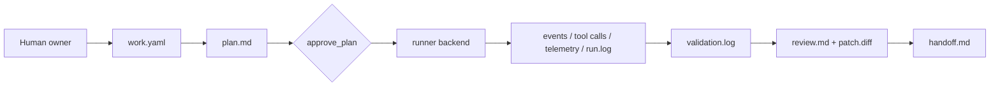
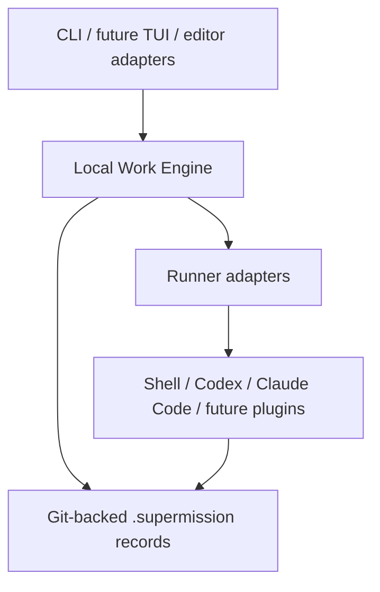

# Supermission

[](#v0-范围)
[](#安装与发布状态)
[](#工具链)
[](#工具链)
[](#验证)
[](./LICENSE)

[English README](./README.md)

Supermission 是一个早期的开源 local-first work records for AI-assisted software delivery 实现。

产品方向是把 AI coding 从聊天记录变成工程记录：任务规格、计划、执行、
验证、评审、交接、回退和可观测证据都沉淀到仓库里。当前实现保持克制：
Bun-first TypeScript、本地优先、Git-backed `.supermission/` 记录、线性代码变更、
强测试和可扩展 runner 层。

## V0 范围

- Git-backed `.supermission/<work-id>/` 任务记录。
- `work.yaml` 作为 work 规格和状态文件。
- `requirements-analysis.md` 用于实现前的需求质量检查。
- Append-only `events.jsonl`、`telemetry.jsonl`、`tool-calls.jsonl`、
  `supervisor-signals.jsonl`。
- `tasks/` 任务台账，保留 actor role、依赖和 mutation mode。
- `plan.md`、`run.log`、`validation.log`、`debug.md`、`handoff.md`、
  `decisions.md`、`review.md`、`monitor.md`、`patch.diff` 等工程产物。
- Headless CLI：创建、规划、批准、执行、验证、追踪、检查、监控、调试和交接。
- 受控变更流程：`supermission change ...`。
- 线性代码变更保护：sidecar 任务后续可并行，但 `linear_write` 同时只能有一个。
- 统一 runner 层：`record`、`shell`、`codex`、`claude` 通过同一 supermission run 接口接入。

核心 engine 保持 runner-neutral。模型运行时放在 runner/adapter 层，按 work 可选启用。

## 多 Agent 流水线系统

Supermission 支持 YAML 定义的多 Agent 流水线，每个阶段可以使用不同的 AI Agent CLI。
内置模板：

- `feature` — 规划 → 编码 → 测试 → 评审
- `bugfix` — 复现 → 修复 → 验证
- `deploy` — 规划 → 编码 → 测试 → 评审 → 部署

```bash
supermission pipeline init                              # 创建模板
supermission pipeline run feature "添加 OAuth2 登录"     # 端到端执行
supermission pipeline run bugfix "修复空指针异常"        # 快速修复
supermission pipeline batch feature "功能A" "功能B"      # 批量执行
```

自定义流水线只需在 `.supermission/pipelines/` 中创建 YAML 文件：

```yaml
name: my-pipeline
stages:
  - id: plan
    role: planner-agent
    backend: gemini
    prompt: "分解这个功能"
    gate: approve_plan
  - id: code
    role: worker-agent
    backend: claude
    prompt: "实现这个功能"
  - id: test
    role: tester-agent
    backend: codex
    validation: "bun run test"
```

## 支持的 Agent 后端

Supermission 支持 12 种 runner 后端，具备智能选择和自动降级：

| 后端 | CLI 命令 | 说明 |
|------|----------|------|
| `shell` | 任意 | 执行本地 shell 命令 |
| `claude` | `claude` | Anthropic Claude Code |
| `codex` | `codex` | OpenAI Codex |
| `gemini` | `gemini` | Google Gemini CLI |
| `aider` | `aider` | Aider AI 结对编程 |
| `opencode` | `opencode` | OpenCode 终端 Agent |
| `copilot` | `gh` | GitHub Copilot CLI |
| `amazon-q` | `q` | Amazon Q Developer |
| `goose` | `goose` | Block Goose Agent |
| `kiro` | `kiro` | AWS Kiro CLI |
| `grok` | `grok` | xAI Grok CLI |
| `record` | — | 记录外部/手动执行 |

智能选择自动检测已安装的 CLI 并按角色路由：

```yaml
# .supermission/runners.yaml
default_backend: auto
fallback_order: [claude, codex, gemini]
routing:
  planner-agent: gemini      # 规划用便宜的
  worker-agent: claude       # 编码用最强的
  tester-agent: codex        # 测试用 Codex
  reviewer-agent: gemini     # 评审用便宜的
```

## 团队协作

基于 Git 的原生协作，无需服务器：

```bash
supermission team init
supermission team add --name "Alice" --role lead
supermission team add --name "Bob" --role developer
supermission team add --name "Codex Worker" --kind agent --role agent --backend codex

supermission new "修复登录 Bug" --assign bob
supermission board                    # 看板视图，显示负责人
supermission board --mine             # 只看我的任务
supermission assign work-001 --to alice
```

团队状态通过 git push/pull 同步。小团队无需服务器。

## 成本追踪

```bash
supermission cost work-001            # 每个后端的 token 用量、运行时间、成本估算
```

## Web 仪表盘

```bash
supermission serve                    # 启动本地仪表盘 http://localhost:4000
supermission serve --port 8080 --open # 自定义端口，自动打开浏览器
```

## 产品形态

Supermission 不应该替代 Codex、Claude Code 或 IDE coding agent。目标形态是：

- 独立的本地 engine，负责 work records、证据、验证、评审、交接和恢复状态。
- 先做好快速 CLI，再做复用同一 engine 的 TUI。
- 提供 adapter/plugin，让 Codex、Claude Code、IDE 和未来 app surface 可以创建 work、读取状态、附加证据或运行验证。
- 后续可以增加后台进程，用于 runner 进度流、取消、通知和缓存投影。

engine 是 source of truth；Codex/Claude/IDE 工具是 worker 或 client。这样既不强迫用户放弃已有 coding agent，也能让每次执行都有稳定的项目证据。

UX 和响应速度不是后期美化，而是产品要求。长时间 runner 任务必须展示阶段、耗时、重试/profile 尝试、最新输出、取消路径和恢复路径；本地 list/status/summary 命令要足够快，适合编码过程中反复使用。

## 安装与发布状态

快速安装（macOS/Linux）：

```bash
curl -fsSL https://raw.githubusercontent.com/hongbinzuo/supermission/main/scripts/install.sh | bash
```

Windows (PowerShell)：

```powershell
irm https://raw.githubusercontent.com/hongbinzuo/supermission/main/scripts/install.ps1 | iex
```

安装脚本会自动检测系统环境，按需安装 Bun，克隆仓库并构建，同时检测你已安装的 Agent CLI。

本地开发：

```bash
bun install
bun run build
bin/supermission --help
```

首次项目设置：

```bash
cd your-project
supermission init                    # 自动检测 Agent CLI，设置默认值
supermission pipeline init           # 创建流水线模板
supermission quick "你的第一个任务"    # 端到端执行
```

发布后的预期 npm 安装方式：

```bash
npm install -g @hongbinzuo/supermission
supermission --help
```

## 工具链

- Bun
- TypeScript
- commander
- zod
- yaml
- minimatch
- Vitest
- fast-check
- Playwright
- StrykerJS
- tsup
- ESLint
- Prettier

## 执行模型

V0 已为编排做准备，但代码变更仍然保持线性。

- 以后可以并行的 sidecar 任务：调研、测试计划、文档、评审、日志分析、验证分析。
- 代码、配置、schema、环境变更继续线性执行，直到 merge queue、回退检查点、
  review gate 和冲突处理成熟。





## 快速开始

```bash
bun install
bun run build

bin/supermission new "Add login validation" \
  --acceptance "Invalid logins show an error" \
  --validation "bun run test"

bin/supermission plan <work-id>
bin/supermission requirements check <work-id>
bin/supermission approve <work-id>
bin/supermission run <work-id> \
  --backend shell \
  --command "printf 'implemented' > runner-output.txt"
bin/supermission run <work-id> \
  --backend codex \
  --profile your-profile \
  --fallback-profile another-profile \
  --prompt "Reply only with codex-smoke-ok." \
  --timeout-ms 60000
bin/supermission run <work-id> \
  --backend claude \
  --prompt "Reply only with claude-smoke-ok." \
  --timeout-ms 60000
bin/supermission validate <work-id>
bin/supermission review create <work-id>
bin/supermission handoff <work-id>
```

## 命令索引

核心流程：

- `supermission new`
- `supermission plan`
- `supermission requirements check`
- `supermission approve`
- `supermission run`
- `supermission validate`
- `supermission handoff`

人类评审和可观测性：

- `supermission status`
- `work summary`
- `supermission monitor`
- `supermission doctor`
- `supermission trace`
- `supermission logs`
- `supermission debug`
- `supermission inspect`
- `supermission review create`
- `supermission policy init`
- `supermission policy show`

受控变更：

- `supermission change propose`
- `supermission change list`
- `supermission change show`
- `supermission change approve`
- `supermission change apply`
- `supermission change reject`
- `supermission change defer`
- `supermission change split`

任务台账：

- `supermission tasks`
- `supermission task add`
- `supermission task set-status`
- `supermission task audit-scope`

Runner 诊断：

- `supermission runner list`
- `supermission runner profiles`
- `supermission runner config init`
- `supermission runner config show`
- `supermission runner smoke`

Git 证据和隔离：

- `supermission diff`
- `supermission checkpoint create`
- `supermission checkpoint list`
- `supermission branch create`
- `supermission worktree create`
- `supermission rollback-plan`
- `supermission rollback-check`

## 产品路线图

路线图按 milestone 维护，必须随实现变化更新。未来 agent 的维护规则见
[`AGENTS.md`](./AGENTS.md)。

| 里程碑 | 重点                                                                                                  | 当前状态 |
| ------ | ----------------------------------------------------------------------------------------------------- | -------- |
| V0     | 本地 work records、CLI 状态机、artifacts、验证、评审、交接、回退计划                                  | 完成     |
| V0.5   | 统一 runner 层：12 种后端（shell、codex、claude、gemini、aider、opencode、copilot、amazon-q、goose、kiro、grok）；智能选择和降级 | 完成     |
| V0.6   | 多 Agent 流水线、团队协作、任务分配、看板视图、成本追踪、Web 仪表盘、安装脚本                         | 完成     |
| V0.7   | 项目管理（里程碑、周期、优先级）、Linear/Jira/GitHub 集成、导入/导出                                  | 进行中   |
| V0.8   | 通知系统（收件箱、Webhook）、锁管理器、冲突检测、协调索引服务                                         | 计划中   |
| V1     | Terminal TUI（React Ink）、完善 Web 仪表盘、Runner 流式进度                                           | 计划中   |
| V1.5   | 编辑器适配器（VS Code、Kiro）、Agent 持久记忆                                                         | 计划中   |
| V2     | 开源扩展点、npm 发布、Homebrew、兼容性目标文档                                                        | 计划中   |

主要对标基线是 Factory Missions 的协作规划、按 milestone 执行和验证闭环。
Supermission 的定位是这个方向的开源、本地优先版本，`.supermission/` 是 source of truth。

参考项目调研见
[`docs/research/agent-orchestration-reference.md`](./docs/research/agent-orchestration-reference.md)。
这些项目用于抽象方法参考，不作为功能堆叠清单。
Kiro、Codex、Claude Code 和 agent 编排差距分析见
[`docs/research/kiro-codex-claude-orchestration-gap-analysis.md`](./docs/research/kiro-codex-claude-orchestration-gap-analysis.md)。
Token 和运行性能策略见
[`docs/research/token-performance-strategy.md`](./docs/research/token-performance-strategy.md)。
Agent 调度、通信和前端性能取舍见
[`docs/research/agent-scheduling-communication-ui-performance.md`](./docs/research/agent-scheduling-communication-ui-performance.md)。
Supermission 自身产品能力测评循环见
[`docs/evaluations/supermission-capability-evaluation.md`](./docs/evaluations/supermission-capability-evaluation.md)。
当前本地确定性 baseline fixture 是
[`evals/supermission-capability-baseline.yaml`](./evals/supermission-capability-baseline.yaml)。
MVP 发布 gate 见
[`docs/releases/mvp-release-checklist.md`](./docs/releases/mvp-release-checklist.md)。
Web 项目验证默认走 Playwright 这种确定性路径；computer/browser-use agent 后续可以
作为探索式 validator 插件，但不能替代可重复断言、截图和 trace 证据。

## 验证

```bash
bun run check
bun run lint
bun run format:check
BUN_BIN="$HOME/.bun/bin/bun" bun run test:capability
BUN_BIN="$HOME/.bun/bin/bun" bun run test
bun run build
```

真实外部 runner smoke test 是显式开启的，避免普通单元测试被本地 profile
缺失影响。需要让真实后端失败阻断时，明确打开：

```bash
SUPERMISSION_RUNNER_SMOKE=codex SUPERMISSION_CODEX_PROFILE=your-profile bun run test
SUPERMISSION_RUNNER_SMOKE=claude bun run test
SUPERMISSION_RUNNER_SMOKE=all SUPERMISSION_CODEX_PROFILE=your-profile bun run test
```

Codex backend 的 `--profile <name>` 会先按名称或 id 匹配 CC Switch 的 codex
provider。匹配成功时，Supermission 会为子进程创建临时 `CODEX_HOME`，不会把
provider secret 写进仓库或 run log。匹配不到时，这个值会继续作为 Codex 原生
`-p/--profile` 传入。

使用 `--profile current` 可以跟随 CC Switch 当前选中的 Codex provider。

需要自动换 profile 时，可以重复传入 `--fallback-profile`；前一个 profile 失败后，
runner 会继续尝试后面的 profile，全部失败才让 supermission run 失败。

项目级默认 runner 配置保存在 `.supermission/runners.yaml`。使用
`supermission runner config init/show` 管理第一版配置；显式传给 `supermission run` 的参数
优先级高于项目配置。

测试覆盖黑盒 CLI 集成、property-based tests、schema validation、失败分支、
supervisor signals 和基础 trace 性能预算。`bun run test:capability` 会运行当前
Supermission 产品能力 baseline，不调用外部模型服务。当前完整测试数量以
`bun run test` 输出为准。

## 决策与剩余工作

- License: Apache-2.0。
- 公开发布路径：先 npm package，再 GitHub Releases；Homebrew/Docker 后置。
- Codex/Claude Code 等真实后端 smoke test 保持显式 opt-in；缺 profile 或凭证要清晰失败，不能泄露密钥。
- 数据库后续只能作为可重建索引/cache，不能取代 `.supermission/` 的 source of truth。
- validation command 为空时到底应标记 `blocked` 还是 `needs_decision`，仍需结合真实使用继续评估。
